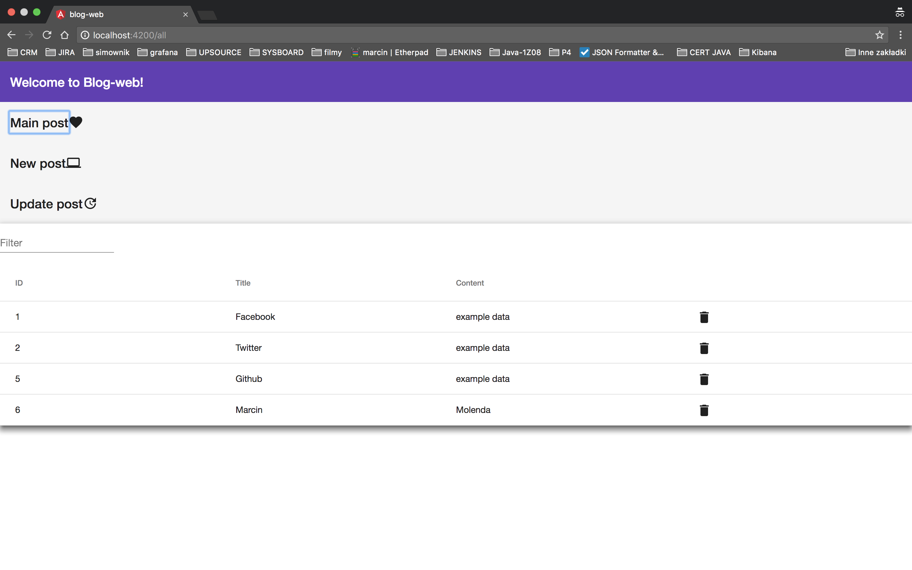

# Blog-web

================================================================================

TECHNOLOGIES

    I have used the following technologies to solve problems in the above project:
    - springboot
    - angular5
    - database h2
    - lombok
    - junit
    - mockito
    - maven ...

================================================================================

================================================================================
Description
================================================================================
On the backend’s side, spring boot has been used because, in my opinion, this is the best way to build web service application. It provides many helpfull practical solutions. I have decided to use h2 database because it is sufficient for this project.

When it comes to frontend, I have used angular 5, for education properties because I never used it before.

================================================================================
================================================================================
How to run
================================================================================

BACK-END

To run the blog-web server, cd into the `blog-web` folder and run `Application.class`. Open <http://localhost:8081>

Tests: `blog-web/test/java`

FRONT-END

This project was generated with [Angular CLI](https://github.com/angular/angular-cli) version 1.6.7.

To run the client, cd into the `client` folder and run `npm install && ng serve`. Open <http://localhost:4200> to load initial data.
